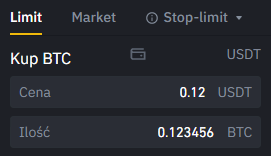
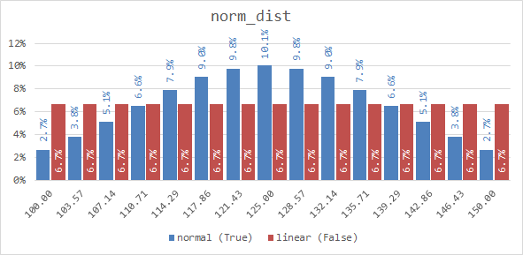

# BinanceTools
###### version 1.2.0

This Python code is used to automize some tedious tasks around opening multiple limit orders in Binance Crypto Exchange.


## Requirements:
#### libraries
```python
pip install python-binance
pip install pandas
pip install numpy
```

#### API
[Generate an API KEY](https://www.binance.com/en/my/settings/api-management), assign relevant permissions:
- Enable Reading
- Enable Spot & Margin Trading

Save your keys in file `parameters/keys.py` as:
```python
Public = '<PASTE YOUR API Key HERE>'
Secret = '<PASTE YOUR Secret Key HERE>'
```
## Running code:
Main file to generate orders is `postOrder.py`: 

For example, if you wish to open **30** orders to **buy Bitcoin** with **1k Tether**, starting at **52k** and ending at
**54k** with **equal** size orders, your code should look like:

```python
from exchange.basics import connect, portfolio
from functions.misc import check_params
from functions.orders import order_manager

if __name__ == '__main__':
    client = connect()
    portfolio = portfolio(client)

    coin = 'BTC'        # <-- edit, coin you want to trade for
    pair = 'USDT'       # <-- edit, coin you want to trade with
    side = 'BUY'        # <-- edit, side you want to trade, either 'BUY' or 'SELL'

    # Choose only one:  [Part: None|1-100, Amount: None|int]
    part = None         # <-- edit, percentage of your pair coin in portfolio you want to trade with
    amount = 1000       # <-- edit, either None or specific value

    start = 52000       # <-- edit, value you want to start your orders
    end = 54000         # <-- edit, value you want to end your orders
    steps = 30          # <-- edit, number of orders you want to place 

    # True = normal distribution, False = linear distribution, [default: False]
    norm_dist = False   # <-- edit, type of orders distribution

    run = check_params(coin, pair)
    if run:
        order_manager(client, portfolio, side, coin, pair, start, end, steps, part, amount, norm_dist)
```

#### order of posting orders
- If you choose to set **BUY**, program will post orders by price **descending**
- If you choose to set **SELL**, program will post orders by price **ascending**
 
#### check_params
If you execute `run = check_params('ABC', 'XYZ')`, you'll get result:
```
Missing coin ABC in params.Coins
Missing coin XYZ in params.Coins
```
Also variable `run` will be `False`, and code won't run any further. Before moving further, you have to add missing coins to
`params.Coins`. For example `BTC` has below parameters:

`'BTC': {'lot': 6, 'price': 2}`

If you want to trade **BTC**, you can open order only with:
- price value with precision = 2 
- lot value with precision = 6

You can check precision manually in Binance BUY/SELL window by checking how many decimals are accepted, like below:



#### part vs. amount
Difference between `part` and `amount`:
- `part` is used to take a percentage of your free asset based on your portfolio. For example if you wish to trade 100%
of your coin you should set `part = 100`, and `amount = None`.
- `amount` is used to trade specific amount of your asset. For example if you wish to trade exactly 1000 USDT,
you should set `amout = 1000` and `part = None`.

Code will check for errors:
- if you gave both variables with a value (`if (part is not None) & (amount is not None)`)
- if you have provided amount above your free assets (`if amount > balance`)

#### steps
Once your parameters are ready, you can open your first order. Program will ask some questions on the run.
In Binance the minimum value of an order has to be **10 USD** or **0.0001 BTC**. If you wish to trade with other pair,
please edit `def order_adjustment()` in `functions/orders.py`.
Questions to answer:
- do you want to open more orders then specified in `steps` if there is a possibility? Code will look for the maximum
number of steps to split your orders while staying above `min_val`.
- do you want to open less orders then specified in `steps` if at least 1 is below `min_val`?
- abort?

#### norm_dist
```python
# True = normal distribution, False = linear distribution, [default: False]
norm_dist = False   # <-- edit, type of orders distribution
```
If `norm_dist = False` then all orders will be divided linearly (equally), (_red bars in chart below_).
If you change that variable to `True`, code will divide your orders based on normal distribution (_blue bars in chart below_).



Stats for 15 orders in price range 100-150 are as below:
```
            normal (True)   linear (False)
count               15.00            15.00
min_price          100.00           100.00
max_price          150.00           150.00
average_price      125.00           125.00
min_coins           17.59            43.33
max_coins           65.37            43.33
average_coins       43.33            43.33
sum                650.00           650.00	
std_dev             16.56             0.00
```

#### 5x limit
Binance isn't letting for orders with price 5 and above times higher then the current price. To handle issues when user
sets `end` value above that limit, function `check_current_price` has been introduced to check and decide on the next
steps. It reads the current price of paired coin and if `end` is above 5x limit, user has to decide, what to do next:
- _(1) - edit end value manually_ - it will stop the program.
- _(2) - limit number of orders (open less then orders, but all within 5x)_ - the amount of traded coins will be reduced
to cover only orders within 5x limitation. Orders above 5x will be ignored.  
- _(3) - apply 5x as new end for 100% of amount_ - the amount of traded coins will remain the same, but price range
will be updated to fit within 5x limitation

## Limitations
Based on API Trading Rules (see: [What kind of limits are there?](https://www.binance.com/en/support/articles/360004492232))
you can be banned from 5 minutes to 3 days if you spam order creation and cancellation very quickly without executing trades.
This program allows you to open hundreds of orders very quickly. Please use trial and error to achieve your ideal
trading pattern and **do not play with opening tones of orders just to close them right after!**

_Error -1015 TOO_MANY_ORDERS_ : API has Hard-Limit of 100 orders per 10 seconds. To keep within this limit, order
creation has been artificially slowed down to 10 orders/second.

## Common issues:
`binance.exceptions.BinanceAPIException: APIError(code=-1021): Timestamp for this request was 1000ms ahead of the server's time.`

This is know issue ([link](https://github.com/sammchardy/python-binance/issues/249)), which I couldn't resolve myself.
The only solution for that is restarting your PC and running code again.

## TO DO:
1. add automatic precision checker
2. work on nice GUI